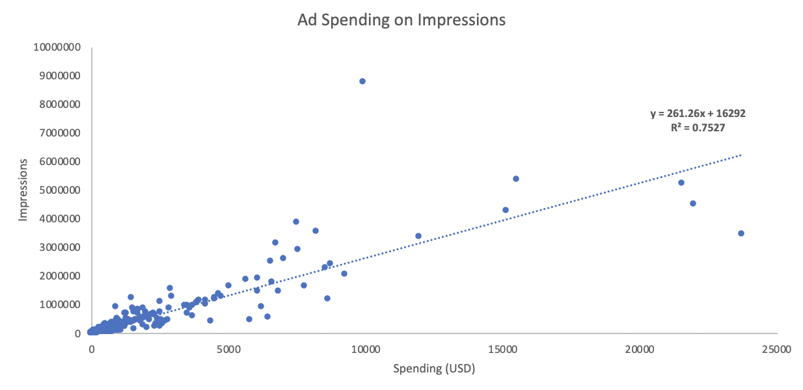
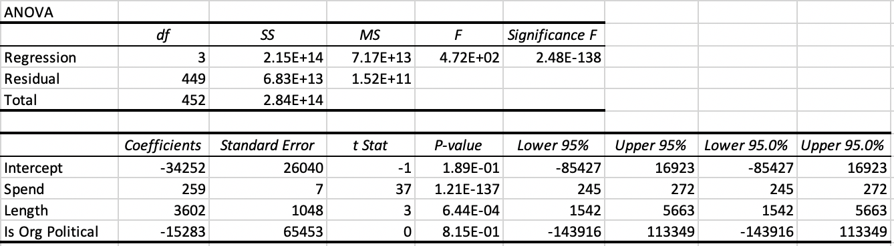
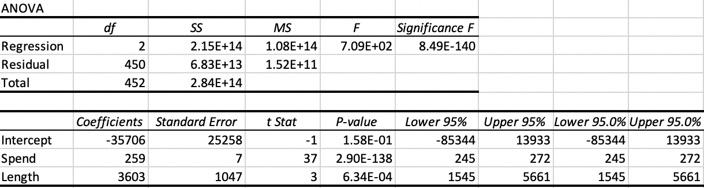

# factors_affecting_political_ads
This project looks at how spending, paying organization, and window of air-time affects the number of impressions of political ads in 2018 on Snapchat. 

## Background
Snapchat, a social media platform most popular with [18-24 year olds](https://info.lse.ac.uk/staff/divisions/communications-division/digital-communications-team/assets/documents/guides/A-Guide-To-Social-Media-Platforms-and-Demographics.pdf), first started hosting advertisements in October 2014. With [301 million monthly active users](https://info.lse.ac.uk/staff/divisions/communications-division/digital-communications-team/assets/documents/guides/A-Guide-To-Social-Media-Platforms-and-Demographics.pdf) each spending an average of 30 minutes on the platform per day, Snapchat's platform provides a unique opportunity for advertisers to target this specific younger demographic, especially in North America where the app is used most. In the last few years, there has been a political movement to engage younger voters and turn the tide on voter apathy. Only [43%](https://ourworldindata.org/usa-electoral-turnout) of young voters (aged 30 and younger) voted in the 2016 election. The accesibility of social media platforms with younger user bases such as Snapchat, TikTok, and Instagram, have all played rolls in helping to reverse this trend as [53%](https://www.vox.com/2020/11/7/21552248/youth-vote-2020-georgia-biden-covid-19-racism-climate-change) of young voters cast ballots in the 2020 presidential election. Knowing how to leverage these social media platforms to reach the most people with political advertisements is an increasingly important issue as political campaigns and nonprofits work towards engaging young people in voting. 

## Business Question
Overarching question: **What logistical factors improve number of impressions for political ads on Snapchat?**
Specific question examined: **How does ad spending, length of air-time, and paying organization type effect number of impressions for political ads on Snapchat?**

## Data Exploration
To explore this question, I used data provided by [Snapchat](https://www.snap.com/en-US/political-ads) to find information on impressions, paying organization, spending, and air-time for political ads in 2018. The raw data files are in the repository. After manipulating the raw data (as explained in the Data Analysis section), I ran a simple linear regression between spending and impressions and air-time and impressions, the two variables that appear most obviously related (Figure 1) and then ran a multivariate regression on all three factors with the dependent variable being impressions (Table 1). Paying organization was insignificant, so I re-ran the regression excluding that as shown in Table 2 to generate an equation predicting impressions. 

#### *Figure 1*

#### *Table 2*

#### *Table 1*

## Discussion
